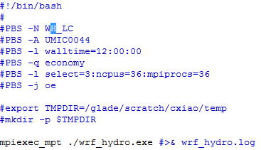

```{r setup, include=FALSE}
knitr::opts_chunk$set(echo = FALSE)
```

## Tentative Schedule  {.build}
* Cheyenne101
* WRF and WRF-Hydro on Cheyenne
* Step-by-step on WRF
* WRF-Hydro & NWM
    + Introduction
    + Hydrofabric
    + Pre-processing
    + WRF-HydroCase
    + Post-processing
* Discussion.

## Traning
| |
|-----+---------------|
| Time | Tuesday 1-2 pm|
|Location| Ontario or Erie|
|Format| Hands-on|
|Discussion| Stop me anytime |

# Cheyenne 101

## Cheyenne
<iframe width="560" height="315" src="https://www.youtube.com/embed/ycNQ_wqsWFc" frameborder="0" allowfullscreen></iframe>  

[NCAR Cheyenne Introduction PPT](https://www2.cisl.ucar.edu/sites/default/files/Cheyenne_Briefing_MesaLab_20160624e.pdf)

## Hardware
| |
|-----+---------------|
| 145,152 processor cores |	2.3-GHz Intel Xeon E5-2697V4 (Broadwell) processors 16 flops per clock | 
| 4,032 computation nodes	| Dual-socket nodes, 18 cores per socket |
| 6 login nodes	| Dual-socket nodes, 18 cores per socket, 256 GB memory/node |
| 313 TB total system memory	| 64 GB/node on 3,168 nodes, DDR4-2400, 128 GB/node on 864 nodes, DDR4-2400 |
| Mellanox EDR InfiniBand, high-speed interconnect	|Partial 9D Enhanced Hypercube single-plane interconnect topology, Bandwidth: 25 GBps bidirectional per link, Latency: MPI ping-pong < 1 µs; hardware link 130 ns |
| 3 times Yellowstone computational capacity |	Comparison based on the relative performance of | the CISL High Performance Computing Benchmarks run on each system. |
| 3.5 times Yellowstone peak performance |	5.34 peak petaflops (vs. 1.504) |

## Logging in  
`ssh -X -l cxiao cheyenne.ucar.edu`  
or   
`ssh -X cxiao@cheyenne.ucar.edu`  

   
If your PC or Mac has the same user name,  
`ssh -X cheyenne.ucar.edu`

## Environment modules  
| |
|-----+---------------|
|**module av** (**module avail**) |Show available modules with the current compiler. |
|**module load R ncl/6.4.0 **| Load software package(s) |
|**module list** |List the modules that are loaded|
|**module unload ncl**|Unload the specified software package(s)|

## Job submission queues and charges  
| Queue name |	Priority order |	Wall clock (hours) |	Description|
|----+----+----+----|
| premium	| 1	| 12 | Jobs are charged at **150%** of the regular rate.|
| regular	| 2	| 12 | Most production batch jobs run in this queue; also accepts interactive jobs.|
| economy	| 3	| 12 |	Production batch jobs charged at **70%** of the regular rate.|
| share	| NA |	6	| Interactive and serial batch use for debugging and other tasks on a single, shared, 128-GB node. Jobs can use up to 18 cores.|

## Job submission with PBS  
  

| |
|-----+---------------|
|Submit a job| `qsub myjob_PBS.sh`  |
|Delete a job| `qdel job_id`  | 
|Check a job |`qstat -u cxiao`  or ` qstat -u $USER`|
|Check history|`qhist -u $USER`|

## GLADE File Spaces 
|File space	|Quota	|Backup	|Purge policy|Description|
|----+----+----+----+----|
|Home: /glade/u/home/username	|25 GB*	|Yes	|Not purged	|User home directory|
|Scratch: /glade/scratch/username	|10 TB	|No	|{**See below**}	|Temporary computational space|
|Work: /glade/p/work/username	|512 GB	|No	|Not purged|	User work space|
|Project: /glade/p/project_code	|N/A	|No	|Not purged	|Project space allocations|

> Individual files are removed from **/glade/scratch/username** automatically if they have not been accessed (for example: modified, read, or copied) in more than 60 days. A file's **access time** (atime) is updated at most once per day for purposes of I/O efficiency. To check a file's atime, run `ls -ul filename`.  

## Storage  
[cxiao@cheyenne2 ~]$gladequota  
Current GLADE space usage: cxiao

  Space                             Used       Quota    % Full
------------------------------ ----------- ----------- ---------
/glade/scratch/cxiao               0.16 TB    10.00 TB    1.60 %
/glade/p/work/cxiao              331.99 GB   512.00 GB   64.84 %
/glade/u/home/cxiao               35.41 GB    50.00 GB   70.82 %

  Space                             Used
------------------------------ -----------  
/glade/p                       - 78.2% used (10913 TB used out of 13948 TB total)  
/glade2/scratch2               - 47.6% used (7317 TB used out of 15360 TB total)

## HPSS  
* High Performance Storage System (HPSS)  
* Logging in: `hsi`  
* Using HTAR to transfer files  
    + Creating an archive file: `htar -cv -f mydata.tar MyData `   
    + Retrieving files: `htar -xv -m -f myncfile.tar `  
    + Listing archive file contents: `htar -tv -f myncfile.tar `  
    
* cput and cget  

## Using data-access nodes  
`ssh username@data-access.ucar.edu`  

* Migrate data from   
    + HPSS tape archive  
    + GLADE disk resource  
    + Research Data Archive (RDA)  
* Transferring files  
    + Globus  
    + SCP/SFTP (**PSCP/PSFTP**, **WinSCP**, or FileZilla)  
    + BBCP  

## Software  
* Applications and analysis packages  
* Community models  
* Libraries  
* Performance and optimization tools  
* Programming support  
* Utilities  

https://www2.cisl.ucar.edu/resources/computational-systems/cheyenne/software  

## WRF 
`cd ~wrfhelp`  
BATCH_SCRIPTS_CHEYENNE  
intel  
PRE_COMPILED_CHEYENNE  
SOURCE_CODE  
UNGRIB_LIBRARIES  
WPS_GEOG

## Research Data Archive  
* Research Data Archive (RDA) data sets, https://rda.ucar.edu/  
* Dataset **nnn.n**, e.g. NARR is ds608.0  
* GLADE  /glade2/collections/rda/data/ds608.0/
* HPSS /FS/DSS/DS608.0/

## Resource
| |
|-----+---------------|
|Cheyenne          | High-performance computing resource|
|Geyser and Caldera| Analysis and visualization systems|
|GLADE             | Centralized file systems and data storage|
|HPSS              | NCAR data archive|

## Geyser and Caldera  
| |
|-----+---------------|
|Geyser, 16 large-memory nodes |`1 TB DDR3-1600 memory per node (1000 GB usable memory per node)`, `IBM x3850, quad-socket nodes`, `Four 10-core, 2.4-GHz Intel Xeon E7-4870 (Westmere EX) processors per node`, `FDR Mellanox InfiniBand, full fat tree`, `1 NVIDIA GPU per node`|
|Caldera, 30 nodes, 16 with GPUs |`64 GB DDR3-1600 memory per node \n(62 GB usable memory per node)`, `IBM x360 M4, dual-socket nodes`, `Two 8-core 2.6-GHz Intel Xeon E5-2670 (Sandy Bridge) processors per node with AVX`, `FDR Mellanox InfiniBand, full fat tree`, `2 NVIDIA GPUs per node (16 nodes)`|

## For Cheyenne Projects  
* **Citation **   
Computational and Information Systems Laboratory. 2017. Cheyenne: HPE/SGI ICE XA System (University Community Computing). Boulder, CO: National Center for Atmospheric Research. doi: [10.5065/D6RX99HX](https://doi.org/10.5065/D6RX99HX).  

* **Acknowledgments**    
_We would like to acknowledge high-performance computing support from Cheyenne (doi:10.5065/D6RX99HX) provided by NCAR's Computational and Information Systems Laboratory, sponsored by the National Science Foundation._


