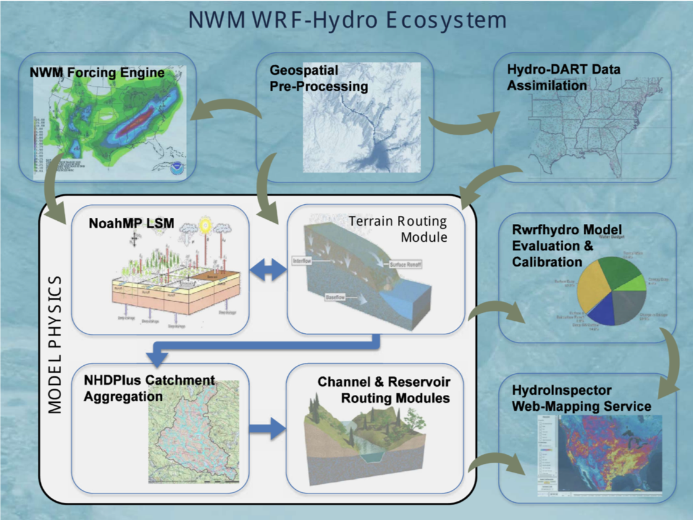

```{r setup, include=FALSE}
knitr::opts_chunk$set(echo = FALSE)
```

# Part I: WRF  
## WRF Tutorial  
* Next WRF Tutorial  
    + Registration is now open. https://www.mmm.ucar.edu/wrf-tutorial-0  
        - The next WRF tutorial will be held **July 23-27, 2018 in Boulder, CO**. For this summer session, there will only be a Basic WRF Tutorial, with no additional tutorials the following week.  

* Future WRF Tutorials  
    + January 2019 and July 2019  
    
* WRF-Hydro Training Workshop  
    + June 5 - 8, 2018, sponsored by [CUAHSI](https://www.cuahsi.org/education/training/training-and-workshops/training-workshop-the-community-wrf-hydro-modeling-system-1)  
    + **Application deadline has passed.** 

 

## WRF Overview  
<div class="columns-2">
* Weather Research and Forecasting (**WRF**)  
    + Meteorological studies  
    + Real-time NWP   
    + Idealized simulations  
    + Data assimilation  
    + Earth system model coupling  
    + Model training and education 
    
\pagebreak     
    
* WRF Variants  
    + **WRF-Hydro**: WRF hydrological modeling system  
    + **WRFDA**: WRF Data Assimilation System  
    + **WRF-Chem**: WRF atmospheric chemistry model
    + **Polar-WRF** ,**HWRF**, **NU-WRF**   


</div>
## WRF Components  
<div class="columns-2">


* As shown in the diagram   
    + The WRF Preprocessing System (WPS)
    + _WRF-DA_
    + **WRF ARW solver**
    + Post-processing & Visualization tools
</div>


## WRF Conponents: WPS  
<div class="columns-2">
* Lake Champlain `namelist.wps`  

<style>
pre {
  font-size: 13px;
  line-height:18px
}
</style>

```yaml
&share
 wrf_core = 'ARW',
 max_dom = 1,
 start_date = '2011-01-01_00:00:00','2014-11-16_00:00:00'
 end_date   = '2011-01-02_00:00:00','2014-11-17_00:00:00'
 interval_seconds = 10800
 io_form_geogrid = 2,
/

&geogrid
 parent_id         =   1,   1,  2,
 parent_grid_ratio =   1,   4,  3,
 i_parent_start    =   1,  20,  93,
 j_parent_start    =   1,  15,  41,
 e_we              =  201, 101, 331,
 e_sn              =  361, 145, 291,
 geog_data_res     = 'modis_15s','modis_15s','2m',
 dx = 1000,
 dy = 1000,
 map_proj = 'lambert',
 ref_lat   = 44.58 ,
 ref_lon   = -73.2,
 truelat1  =  30.0,
 truelat2  =  60.0,
 stand_lon = -97,
 geog_data_path = '/glade/u/home/wrfhelp/WPS_GEOG'
/

&ungrib
 out_format = 'WPS',
 prefix = 'FILE',
/

&metgrid
 fg_name = 'FILE'
 io_form_metgrid = 2,
/
```

* defining simulation domains  
* interpolating terrestrial data to the simulation domain  
* degribbing and interpolating meteorological data  

  
<br><br><br><br><br>  

</div>

## WRF Data Flow  
<div class="columns-2">
<div align="center">

</div>

* Executables  

* Data Flow  
 <br>  <br>  <br>

<div align="center">

</div>

</div>

## WRF Resource 
| |
|----+----|
|WRF User’s Guides online/pdf | http://www2.mmm.ucar.edu/wrf/users/docs/user_guide_V3/contents.html|
|Semi-annual WRF Tutorial (July and January) | http://www2.mmm.ucar.edu/wrf/users/supports/tutorial.html|
|Annual WRF Users Workshop | http://www2.mmm.ucar.edu/wrf/users/supports/workshop.html|
|WRF Forum |http://forum.wrfforum.com/ |


# Part II: WRF-Hydro  
## WRF Directory  
To show on computer  

```yaml
cd ~wrfhelp/PRE_COMPILED_CHEYENNE/WRFV3.7.1_intel_dmpar_large-file
tree
```

## WRF-Hydro Framework  
<div class="columns-2">

<div align="center">

</div>

<div align="center">

</div>

</div>
(Courtesy **WRF-Hdyro Training Material**)  

## WRF-Hydro Framework  

<iframe width="560" height="315" src="https://www.youtube.com/embed/KSAeyVYovOQ?rel=0&amp;start=452" frameborder="0" allow="autoplay; encrypted-media" allowfullscreen></iframe>

## WRF-Hydro Dataflow  
<div align="center">

</div>
(Courtesy **WRF-Hdyro Training Material**)  

## WRF-Hydro Code Framework  
To show on computer  

```yaml
cd /glade/u/home/cxiao/WORK/WRFHydro5.0/wrf_hydro_community_v5.0.0/
tree
```

##  WRF-Hydro training material  

https://ral.ucar.edu/projects/wrf_hydro/training-materials 
```
Multi-scale Water Cycle Predictions Using the Community WRF-Hydro Modeling System  
WRF-Hydro: System Conceptualization  
Compiling and Executing WRF-Hydro  
WRF-Hydro & NoahMP LSM Physics Overview  
WRF-Hydro System: Physics Components  
Channel Routing & Lakes and Reservoirs in WRF-Hydro  
WRF-Hydro Forcing & Preprocessing Input Data Requirements  
Overview of the ArcGIS WRF-Hydro Pre-processing Tool  
WRF-Hydro: Coupling with WRF  
The WRF-Hydro Modeling System: Implementation & Calibration Approaches  
WRF-Hydro Data Assimilation Approaches  
WRF-Hydro Calibration Approaches  
WRF-Hydro hydro.namelist files with Description of Options  
NoahMP namelist.hrldas with a Description of Options  
```

