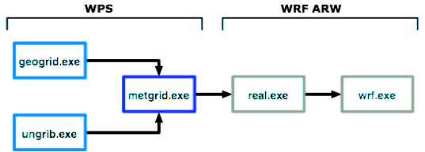

```{r setup, include=FALSE}
knitr::opts_chunk$set(echo = FALSE)
```

# Part I: WRF  
## Review of WRF framework  

 

## Executables  

  


## Install WPS and WRF  
`cd ~wrfhelp`  
```
BATCH_SCRIPTS_CHEYENNE  
intel  
PRE_COMPILED_CHEYENNE  
SOURCE_CODE  
UNGRIB_LIBRARIES  
WPS_GEOG
```
## Get compiled code  
```yaml
cd /glade/scratch/cxiao
mkdir WRFTest
cd WRFTest  
mkdir WPS 
mkdir WRFV3
cp -r ~wrfhelp/PRE_COMPILED_CHEYENNE/WPSV3.7.1_intel_serial_large-file/* WPS/ 
cp ~wrfhelp/PRE_COMPILED_CHEYENNE/WRFV3.7.1_intel_dmpar_large-file/test/em_real/* WRFV3/
```
## WPS: `namelist.wps` 
`cd WPS` 

* Replace the example with my Lake Champlain `namelist.wps`  
    + `cp ~cxiao/WORK/Champlain/WPS/namelist.wps .`  
* Check (adjust) model domain 
    + `module load ncl`  
    + `ncl util/plotgrids_new.ncl`  
  
## WPS: run executables  
* Generate static terrain file  
     + `./geogrid.exe`  
* Extract forcing file  
     + Forcing (e.g. NARR) in GRIB format  
         - `./link_grib.csh ~cxiao/DATA/20110101/*`
     + Vtable  
         - `ln -sf ungrib/Variable_Tables/Vtable.NARR Vtable`  
     + ungrib  
         - `./ungrib.exe`  
* Regrid forcing file in **parallel**   
     + `cp ~cxiao/WORK/Champlain/WPS/runmetgrid.sh .`  
     + `qsub runmetgrid.sh`
     
## WRF: `namelist.input`  
`cd ../WRFV3` 

* Replace the example with my Lake Champlain `namelist.input`  
    + `cp ~cxiao/WORK/Champlain/WRF/namelist.input .`  
* Job submission scripts   
    + `cp ~cxiao/WORK/Champlain/WRF/runreal.sh .`  
    + `cp ~cxiao/WORK/Champlain/WRF/runwrf.sh .`  
* Submit jobs     
    + `qsub runreal.sh`  
    + `qsub runwrf.sh`  


# Part II: WRF-Hydro  
## Define domain  
* WPS `geogrid.exe`  
    + geo_em.d01.nc
* WRF `real.exe` 
    + wrfinput.nc

## Hydrofabic 
```
* WRF-Hydro ArcGIS Toolbox
    + https://github.com/NCAR/wrf_hydro_arcgis_preprocessor  
    
├── Fulldom_hires.nc
├── GENPARM.TBL
├── geo_em.d01.nc
├── GEOGRID_LDASOUT_Spatial_Metadata.nc
├── GWBUCKPARM_LC_20180412.nc
├── GWBUCKPARM.TBL
├── HYDRO.TBL
├── HYDRO_TBL_2D.nc
├── LAKEPARM_2018_04_25.nc
├── MPTABLE.TBL
├── RouteLink_LakeChamplain2018_04_12.nc
├── SOILPARM.TBL
├── soil_properties.nc
├── spatialweights_1000m_v1_LakeChamplain_20180412.nc
├── spatialweights_100m_v1_LakeChamplain_20180412.nc
├── wrfinput.nc

```

## Generate Forcing  
* NLDAS2 (13 km) ----> WRF-Hydro land component (1 km)  
* NCL with Earth System Modeling Framework (ESMF) `ESMF_regrid`   
    + https://www.ncl.ucar.edu/Applications/ESMF.shtml  

```
FORCING/2011010100.LDASIN_DOMAIN1
FORCING/2011010101.LDASIN_DOMAIN1
FORCING/2011010102.LDASIN_DOMAIN1
FORCING/2011010103.LDASIN_DOMAIN1
FORCING/2011010104.LDASIN_DOMAIN1
FORCING/2011010105.LDASIN_DOMAIN1
FORCING/2011010106.LDASIN_DOMAIN1
FORCING/2011010107.LDASIN_DOMAIN1
FORCING/2011010108.LDASIN_DOMAIN1
FORCING/2011010109.LDASIN_DOMAIN1
```

## WRF-Hydro configuration  
* Coarse land component `namelist.hrldas`  
* Fine routing component `hydro.namelist` 

## Submit job

`qsub submit_wrf_hydro.sh`

## Post-processing  
* `rwrfhydro` (https://github.com/NCAR/rwrfhydro)  
* `wrf_hydro_py` (https://github.com/NCAR/wrf_hydro_py)    


