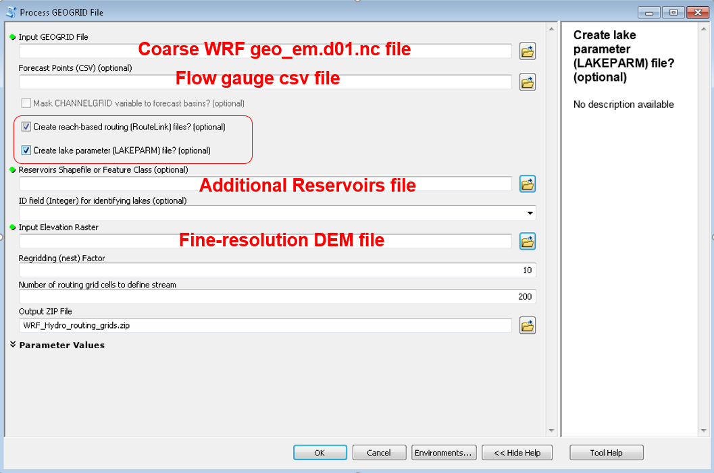

```{r setup, include=FALSE}
knitr::opts_chunk$set(echo = TRUE)
```

# Part II: WRF-Hydro 

## WRF-Hydro Dataflow  
<div align="center">

</div>
(Courtesy **WRF-Hdyro Training Material**) 

## Model domain defined by WRF/WPS   
 

* WPS `geogrid.exe`  
    + geo_em.d01.nc
* WRF `real.exe` 
    + wrfinput.nc  
    
## WRF-Hydro ArcGIS Toolbox  
https://github.com/NCAR/wrf_hydro_arcgis_preprocessor  

<div align="center">

</div>

## Hydrofabic 
```
├── Fulldom_hires.nc
├── GENPARM.TBL
├── geo_em.d01.nc
├── GEOGRID_LDASOUT_Spatial_Metadata.nc
├── GWBUCKPARM_LC_20180412.nc
├── GWBUCKPARM.TBL
├── HYDRO.TBL
├── HYDRO_TBL_2D.nc
├── LAKEPARM_2018_04_25.nc
├── MPTABLE.TBL
├── RouteLink_LakeChamplain2018_04_12.nc
├── SOILPARM.TBL
├── soil_properties.nc
├── spatialweights_100m_v1_LakeChamplain_20180412.nc
├── wrfinput.nc

```

## Generate Forcing  
* NLDAS2 (13 km) ----> WRF-Hydro land component (1 km)  
* NCL with Earth System Modeling Framework (ESMF) `ESMF_regrid`   
    + https://www.ncl.ucar.edu/Applications/ESMF.shtml  

```
FORCING/2011010100.LDASIN_DOMAIN1
FORCING/2011010101.LDASIN_DOMAIN1
FORCING/2011010102.LDASIN_DOMAIN1
FORCING/2011010103.LDASIN_DOMAIN1
FORCING/2011010104.LDASIN_DOMAIN1
FORCING/2011010105.LDASIN_DOMAIN1
FORCING/2011010106.LDASIN_DOMAIN1
FORCING/2011010107.LDASIN_DOMAIN1
FORCING/2011010108.LDASIN_DOMAIN1
FORCING/2011010109.LDASIN_DOMAIN1
```
## Try WRF-Hydro 1: Model code  

* Copy compiled WRF-Hydro  
```yaml
cd /glade2/scratch2/cxiao
mkdir Champlain
cd  Champlain
mkdir Run
cd Run
cp ~cxiao/wrf_hydro_community_v5.0.0/Run/wrf_hydro_NoahMP.exe wrf_hydro.exe
cp ~cxiao/wrf_hydro_community_v5.0.0/Run/*TBL .
```
## Try WRF-Hydro 2: Hydrofabic and Forcing

Generate _Hydrofabic_ `DOMAIN` files and meteorological `FORCING`  

Link `DOMAIN` and `FORCING` directories  
```yaml
ln -sf /glade2/scratch2/cxiao/Champlain/Run/DOMAIN DOMAIN
ln -sf /glade2/scratch2/cxiao/Champlain/Run/FORCING FORCING
```
## Try WRF-Hydro 3: WRF-Hydro configuration  
    + Coarse land component `namelist.hrldas`  
    + Fine routing component `hydro.namelist`
    
```yaml
cp /glade2/scratch2/cxiao/Champlain/Run/namelist.hrldas .
cp /glade2/scratch2/cxiao/Champlain/Run/hydro.namelist .
```
## Try WRF-Hydro 4: Submit a job  
```yaml
cp /glade2/scratch2/cxiao/Champlain/Run/submit_wrf_hydro.sh .
```

```yaml
#!/bin/bash
#
#PBS -N WH_LC
#PBS -A UMIC0044
#PBS -l walltime=12:00:00
#PBS -q economy
#PBS -l select=3:ncpus=36:mpiprocs=36
#PBS -j oe

#export TMPDIR=/glade/scratch/cxiao/temp
#mkdir -p $TMPDIR

mpiexec_mpt ./wrf_hydro.exe 
```

`qsub submit_wrf_hydro.sh`

## Try WRF-Hydro 5: Post-processing
* Output netcdf file control in `hydro.namelist`  
```yaml
-rw-r--r-- 1 cxiao ncar   39231 Apr 30 15:08 201101010000.CHANOBS_DOMAIN1
-rw-r--r-- 1 cxiao ncar  144684 Apr 30 15:08 201101010000.CHRTOUT_DOMAIN1
-rw-r--r-- 1 cxiao ncar 2509327 Apr 30 15:08 201101010000.LDASOUT_DOMAIN1

-rw-r--r-- 1 cxiao ncar 33727720 May  7 15:22 frxst_pts_out.New.txt
```

## Post-processing: packages  
* R  
    + `rwrfhydro` (https://github.com/NCAR/rwrfhydro)  
* Python   
    + `wrf_hydro_py` (https://github.com/NCAR/wrf_hydro_py)   
    