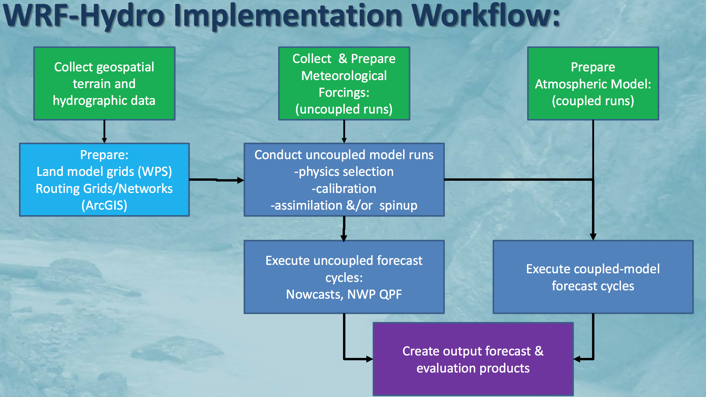
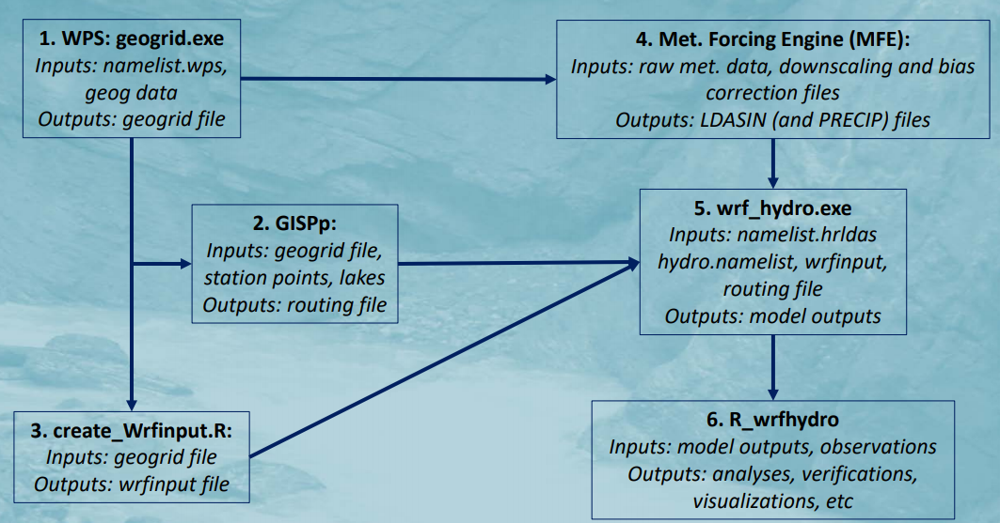

```{r xaringan-themer, include=FALSE}
library(xaringanthemer)
```

#Using git to connect GitHub  
* To clone  
```git
git clone https://github.com/ChuliangXiao/Training.git
```

* To update 
```git
cd Training
git pull
```
---

# Outline
 
#### Review of WRF-Hydro Workflow 

#### WRF-Hydro Input and Output
* WRF-Hydro Output  
    + ASCII: `frxst_pts_out.txt`   
    + NetCDF: `201101010000.CHANOBS_DOMAIN1`   

* Comparison with USGS 

* Mean-area Precipitation  

---

# Offline WRF-Hydro Workflow    
<div align="center">

</div>
(Courtesy **WRF-Hdyro Training Material**) 

---

# WRF-Hydro Workflow  
<div align="center">

</div>
(Courtesy **WRF-Hdyro Training Material**) 

---


# WRF-Hydro Output  
```
/glade2/scratch2/cxiao/Champlain/Stream
```

* Download USGS  
`download.US.R`  

* Read in `CHANOBS`  
`read.CHRTOUT.US.R`  

* Caclulate Mean Area Precipitation  
`Calc_Mean_Areal.R`  
`MAP.R`  

* Plot Hydrograph  
`Hydrograph.Comp.US.ggplot2.png.R`  

