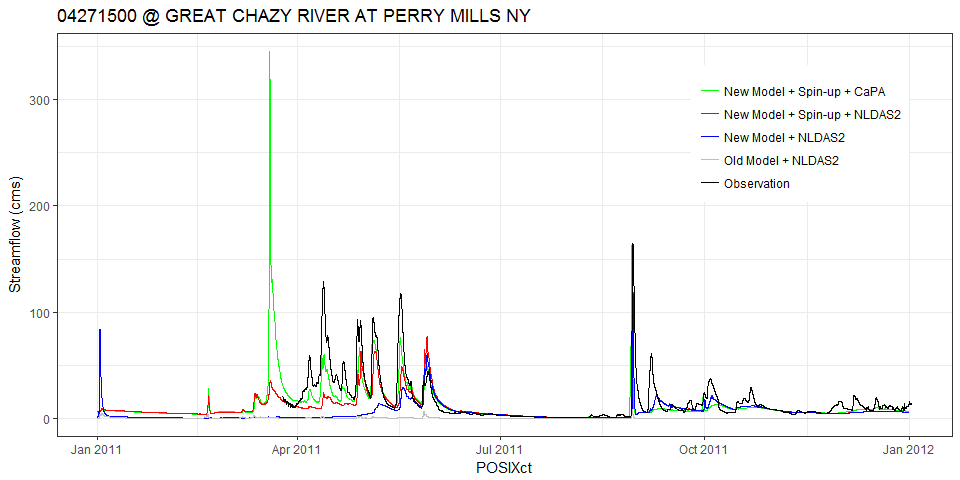

### Load library

``` r
library(tidyverse)
library(rwrfhydro)
library(dataRetrieval)
```

### CTL run without hydrofabric denoted as "Old Model + NLDAS2"

``` r
streamflow  <- ReadFrxstPts('frxst_pts_out.CTL.txt')

gages2  <- distinct(streamflow, st_id, st_lon, st_lat)
near    <- FindUsgsStns(stnLon = gages2$st_lon, stnLat = gages2$st_lat, within = .005)
streamflow$site_no  <- rep(near$site_no, nrow(streamflow)/nrow(near))
    
md0DF           <- streamflow
md0DF['type']   <- "Old Model + NLDAS2"
str(md0DF)
```

    ## 'data.frame':    289113 obs. of  12 variables:
    ##  $ secs   : int  3600 3600 3600 3600 3600 3600 3600 3600 3600 3600 ...
    ##  $ timest : chr  "2011-01-01 00:00:00" "2011-01-01 00:00:00" "2011-01-01 00:00:00" "2011-01-01 00:00:00" ...
    ##  $ st_id  : chr  "      0" "      1" "      2" "      3" ...
    ##  $ st_lon : num  -73 -73.3 -73.5 -73.2 -73.2 ...
    ##  $ st_lat : num  43.6 43.6 43.9 44 44.1 ...
    ##  $ q_cms  : num  0 0 0 0 0 0 0 0 0 0 ...
    ##  $ q_cfs  : num  0 0 0 0 0 0 0 0 0 0 ...
    ##  $ dpth_m : num  0.03 0.02 0.02 0.03 0.03 0.03 0.02 0.02 0.03 0.03 ...
    ##  $ POSIXct: POSIXct, format: "2011-01-01 00:00:00" "2011-01-01 00:00:00" ...
    ##  $ wy     : num  2011 2011 2011 2011 2011 ...
    ##  $ site_no: chr  "04282000" "04280000" "04276842" "04282500" ...
    ##  $ type   : chr  "Old Model + NLDAS2" "Old Model + NLDAS2" "Old Model + NLDAS2" "Old Model + NLDAS2" ...

### Read streamflow values for from "New Model + NLDAS2"

``` r
md1DF       <- get(load("CHRTOUT.US.2011.Rdata"))
md1DF['type']   <- "New Model + NLDAS2"
```

### Read streamflow from "New Model + Spin-up + NLDAS2"

``` r
md2DF       <- get(load("CHRTOUT.US.2011.spin.Rdata"))
md2DF['type']   <- "New Model + Spin-up + NLDAS2"
```

### Read streamflow from "New Model + Spin-up + CaPA"

``` r
md3DF       <- get(load("CHRTOUT.CaPA.2011.Rdata"))
md3DF['type']   <- "New Model + Spin-up + CaPA"
```

### USGS observation

``` r
obsDF   <- get(load('USGS_Champlain_US_2011.All.Rdata'))
obsDF <- renameNWISColumns(obsDF)
colnames(obsDF)[3]      <- "POSIXct"
obsDF['q_cms']     <- obsDF$Flow_Inst/35
obsDF['type']       <- "Observation"
str(obsDF)
```

    ## 'data.frame':    1139610 obs. of  8 variables:
    ##  $ agency_cd   : chr  "USGS" "USGS" "USGS" "USGS" ...
    ##  $ site_no     : chr  "04271500" "04271500" "04271500" "04271500" ...
    ##  $ POSIXct     : POSIXct, format: "2011-03-25 05:00:00" "2011-03-25 05:15:00" ...
    ##  $ Flow_Inst   : num  726 726 731 726 715 710 705 705 705 705 ...
    ##  $ Flow_Inst_cd: chr  "A" "A" "A" "A" ...
    ##  $ tz_cd       : chr  "UTC" "UTC" "UTC" "UTC" ...
    ##  $ q_cms       : num  20.7 20.7 20.9 20.7 20.4 ...
    ##  $ type        : chr  "Observation" "Observation" "Observation" "Observation" ...
    ##  - attr(*, "url")= chr "https://nwis.waterservices.usgs.gov/nwis/iv/?site=04271500,04271815,04273500,04273700,04273800,04275000,04275500,04276500,04276"| __truncated__
    ##  - attr(*, "siteInfo")='data.frame': 9 obs. of  13 variables:
    ##   ..$ station_nm          : chr  "GREAT CHAZY RIVER AT PERRY MILLS NY" "LITTLE CHAZY RIVER NEAR CHAZY NY" "SARANAC RIVER AT PLATTSBURGH NY" "SALMON RIVER AT SOUTH PLATTSBURGH NY" ...
    ##   ..$ site_no             : chr  "04271500" "04271815" "04273500" "04273700" ...
    ##   ..$ agency_cd           : chr  "USGS" "USGS" "USGS" "USGS" ...
    ##   ..$ timeZoneOffset      : chr  "-05:00" "-05:00" "-05:00" "-05:00" ...
    ##   ..$ timeZoneAbbreviation: chr  "EST" "EST" "EST" "EST" ...
    ##   ..$ dec_lat_va          : num  45 44.9 44.7 44.6 44.6 ...
    ##   ..$ dec_lon_va          : num  -73.5 -73.4 -73.5 -73.5 -73.5 ...
    ##   ..$ srs                 : chr  "EPSG:4326" "EPSG:4326" "EPSG:4326" "EPSG:4326" ...
    ##   ..$ siteTypeCd          : chr  "ST" "ST" "ST" "ST" ...
    ##   ..$ hucCd               : chr  "04150408" "04150408" "04150406" "04150408" ...
    ##   ..$ stateCd             : chr  "36" "36" "36" "36" ...
    ##   ..$ countyCd            : chr  "36019" "36019" "36019" "36019" ...
    ##   ..$ network             : chr  "NWIS" "NWIS" "NWIS" "NWIS" ...
    ##  - attr(*, "variableInfo")='data.frame': 1 obs. of  7 variables:
    ##   ..$ variableCode       : chr "00060"
    ##   ..$ variableName       : chr "Streamflow, ft&#179;/s"
    ##   ..$ variableDescription: chr "Discharge, cubic feet per second"
    ##   ..$ valueType          : chr "Derived Value"
    ##   ..$ unit               : chr "ft3/s"
    ##   ..$ options            : chr ""
    ##   ..$ noDataValue        : logi NA
    ##  - attr(*, "disclaimer")= chr "Provisional data are subject to revision. Go to http://waterdata.usgs.gov/nwis/help/?provisional for more information."
    ##  - attr(*, "statisticInfo")='data.frame':    1 obs. of  2 variables:
    ##   ..$ statisticCd  : chr "00000"
    ##   ..$ statisticName: chr ""
    ##  - attr(*, "queryTime")= POSIXct, format: "2018-01-31 16:16:57"

### Station name

``` r
siteINFO    <- get(load("USGS_Champlain_siteINFO.Rdata"))
station_nm  <- siteINFO$station_nm
```

### Subset and combine

``` r
stdate  <- as.POSIXct("2011-01-01 00:00:00")
enddate <- as.POSIXct("2011-12-31 00:00:00")

md0DFt  <- filter(md0DF, POSIXct >= stdate & POSIXct <= enddate)
```

    ## Warning: package 'bindrcpp' was built under R version 3.3.3

``` r
md1DFt  <- filter(md1DF, POSIXct >= stdate & POSIXct <= enddate)
md2DFt  <- filter(md2DF, POSIXct >= stdate & POSIXct <= enddate)
obsDFt  <- filter(obsDF, POSIXct >= stdate & POSIXct <= enddate)
merDFt  <- rbind(obsDF[, c("site_no", "POSIXct", "q_cms", "type")], 
                md0DF[, c("site_no", "POSIXct", "q_cms", "type")],
                md1DF[, c("site_no", "POSIXct", "q_cms", "type")],
                md2DF[, c("site_no", "POSIXct", "q_cms", "type")],
                md3DF[, c("site_no", "POSIXct", "q_cms", "type")])
merDFt$type <- factor(merDFt$type, level = c("New Model + Spin-up + CaPA",
                                             "New Model + Spin-up + NLDAS2", 
                                             "New Model + NLDAS2",
                                             "Old Model + NLDAS2",
                                             "Observation"))    
```

Plot hydrograph
---------------

``` r
gName   <- "04193500"
gages <- sort(unique(trimws(md1DFt$site_no)))
i     <- 1
#for (i in 1 : length(gages)) {
    print(gages[i])
```

    ## [1] "04271500"

``` r
    gName       <- gages[i]
    sName       <- subset(siteINFO, site_no == gName)$station_nm

    md1DF0      <- subset(md1DFt, trimws(site_no) == gName)
    md2DF0      <- subset(md2DFt, trimws(site_no) == gName)
    obsDF0      <- subset(obsDFt, trimws(site_no) == gName)
    merDF0      <- subset(merDFt, trimws(site_no) == gName)
    obsAv       <- mean(obsDF0$q_cms)
  if (gName %in% obsDF0$site_no && obsAv > 0.1) {
    plt     <- ggplot(merDF0, aes(POSIXct, q_cms, color = type)) +
      geom_line() +
            ylab("Streamflow (cms)") +
            labs(title = paste0(gName, " @ ", sName)) + 
            scale_color_manual(values = c("green", "red", "blue", "grey", "black")) +
            theme_bw() +
            theme(legend.position = c(0.83, 0.75),
                  legend.title    = element_blank())
    plt
#    ggsave(pngName, width = 8, height = 4, dpi = 300)
   }
```



``` r
#}
```
