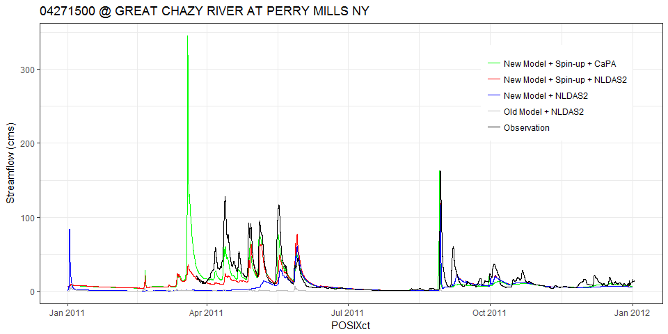

### Load library

``` r
library(tidyverse)
library(rwrfhydro)
library(dataRetrieval)
```

### CTL run without hydrofabric denoted as "Old Model + NLDAS2"

``` r
ctlSF         <- ReadFrxstPts('frxst_pts_out.CTL.txt')

gages2        <- distinct(ctlSF, st_id, st_lon, st_lat)
near          <- FindUsgsStns(stnLon = gages2$st_lon, 
                              stnLat = gages2$st_lat, 
                              within = .005)
ctlSF$site_no   <- rep(near$site_no, nrow(ctlSF)/nrow(near))
    
md0DF         <- ctlSF
md0DF['type'] <- "Old Model + NLDAS2"
str(md0DF)
```

    ## 'data.frame':    289113 obs. of  12 variables:
    ##  $ secs   : int  3600 3600 3600 3600 3600 3600 3600 3600 3600 3600 ...
    ##  $ timest : chr  "2011-01-01 00:00:00" "2011-01-01 00:00:00" "2011-01-01 00:00:00" "2011-01-01 00:00:00" ...
    ##  $ st_id  : chr  "      0" "      1" "      2" "      3" ...
    ##  $ st_lon : num  -73 -73.3 -73.5 -73.2 -73.2 ...
    ##  $ st_lat : num  43.6 43.6 43.9 44 44.1 ...
    ##  $ q_cms  : num  0 0 0 0 0 0 0 0 0 0 ...
    ##  $ q_cfs  : num  0 0 0 0 0 0 0 0 0 0 ...
    ##  $ dpth_m : num  0.03 0.02 0.02 0.03 0.03 0.03 0.02 0.02 0.03 0.03 ...
    ##  $ POSIXct: POSIXct, format: "2011-01-01 00:00:00" "2011-01-01 00:00:00" ...
    ##  $ wy     : num  2011 2011 2011 2011 2011 ...
    ##  $ site_no: chr  "04282000" "04280000" "04276842" "04282500" ...
    ##  $ type   : chr  "Old Model + NLDAS2" "Old Model + NLDAS2" "Old Model + NLDAS2" "Old Model + NLDAS2" ...

### Read streamflow values for from "New Model + NLDAS2"

``` r
md1DF             <- get(load("CHRTOUT.US.2011.Rdata"))
md1DF['type']   <- "New Model + NLDAS2"
```

### Read streamflow from "New Model + Spin-up + NLDAS2"

``` r
md2DF             <- get(load("CHRTOUT.US.2011.spin.Rdata"))
md2DF['type']   <- "New Model + Spin-up + NLDAS2"
```

### Read streamflow from "New Model + Spin-up + CaPA"

``` r
md3DF             <- get(load("CHRTOUT.CaPA.2011.Rdata"))
md3DF['type']   <- "New Model + Spin-up + CaPA"
```

### USGS observation

``` r
obsDF               <- get(load('USGS_Champlain_US_2011.All.Rdata'))
obsDF               <- renameNWISColumns(obsDF)
colnames(obsDF)[3]  <- "POSIXct"
obsDF['q_cms']      <- obsDF$Flow_Inst/35.315
obsDF['type']       <- "Observation"
head(obsDF)
```

    ##   agency_cd  site_no             POSIXct Flow_Inst Flow_Inst_cd tz_cd
    ## 1      USGS 04271500 2011-03-25 05:00:00       726            A   UTC
    ## 2      USGS 04271500 2011-03-25 05:15:00       726            A   UTC
    ## 3      USGS 04271500 2011-03-25 05:30:00       731            A   UTC
    ## 4      USGS 04271500 2011-03-25 05:45:00       726            A   UTC
    ## 5      USGS 04271500 2011-03-25 06:00:00       715            A   UTC
    ## 6      USGS 04271500 2011-03-25 06:15:00       710            A   UTC
    ##      q_cms        type
    ## 1 20.55784 Observation
    ## 2 20.55784 Observation
    ## 3 20.69942 Observation
    ## 4 20.55784 Observation
    ## 5 20.24635 Observation
    ## 6 20.10477 Observation

##### Tidyverse

``` r
load('USGS_Champlain_US_2011.All.Rdata', temp <- new.env())
obsTB <- temp$obsDF %>% 
  as_tibble() %>% 
  renameNWISColumns() %>% 
  rename(POSIXct = dateTime) %>% 
  mutate(q_cms = Flow_Inst/35.315,
         type  = "Observation")
```

    ## Warning: package 'bindrcpp' was built under R version 3.3.3

``` r
head(obsTB)
```

    ## # A tibble: 6 x 8
    ##   agency_cd site_no POSIXct             Flow_Inst Flow_Inst_cd tz_cd q_cms
    ##   <chr>     <chr>   <dttm>                  <dbl> <chr>        <chr> <dbl>
    ## 1 USGS      042715~ 2011-03-25 05:00:00       726 A            UTC    20.6
    ## 2 USGS      042715~ 2011-03-25 05:15:00       726 A            UTC    20.6
    ## 3 USGS      042715~ 2011-03-25 05:30:00       731 A            UTC    20.7
    ## 4 USGS      042715~ 2011-03-25 05:45:00       726 A            UTC    20.6
    ## 5 USGS      042715~ 2011-03-25 06:00:00       715 A            UTC    20.2
    ## 6 USGS      042715~ 2011-03-25 06:15:00       710 A            UTC    20.1
    ## # ... with 1 more variable: type <chr>

### Station name

``` r
siteINFO    <- get(load("USGS_Champlain_siteINFO.Rdata"))
station_nm  <- siteINFO$station_nm
```

### Subset and combine

``` r
stdate  <- as.POSIXct("2011-01-01 00:00:00")
enddate <- as.POSIXct("2011-12-31 00:00:00")

md0DFt  <- filter(md0DF, POSIXct >= stdate & POSIXct <= enddate)
md1DFt  <- filter(md1DF, POSIXct >= stdate & POSIXct <= enddate)
md2DFt  <- filter(md2DF, POSIXct >= stdate & POSIXct <= enddate)
obsDFt  <- filter(obsDF, POSIXct >= stdate & POSIXct <= enddate)
merDFt  <- rbind(obsDF[, c("site_no", "POSIXct", "q_cms", "type")], 
                md0DF[, c("site_no", "POSIXct", "q_cms", "type")],
                md1DF[, c("site_no", "POSIXct", "q_cms", "type")],
                md2DF[, c("site_no", "POSIXct", "q_cms", "type")],
                md3DF[, c("site_no", "POSIXct", "q_cms", "type")])
merDFt$type <- factor(merDFt$type, level = c("New Model + Spin-up + CaPA",
                                             "New Model + Spin-up + NLDAS2", 
                                             "New Model + NLDAS2",
                                             "Old Model + NLDAS2",
                                             "Observation"))    
```

Plot hydrograph
---------------

``` r
gages <- sort(unique(trimws(md1DFt$site_no)))
i     <- 1
#for (i in 1 : length(gages)) {
    print(gages[i])
```

    ## [1] "04271500"

``` r
    gName       <- gages[i]
    sName       <- subset(siteINFO, site_no == gName)$station_nm

    md1DF0      <- subset(md1DFt, trimws(site_no) == gName)
    md2DF0      <- subset(md2DFt, trimws(site_no) == gName)
    obsDF0      <- subset(obsDFt, trimws(site_no) == gName)
    merDF0      <- subset(merDFt, trimws(site_no) == gName)
    obsAv         <- mean(obsDF0$q_cms)
    
  if (gName %in% obsDF0$site_no && obsAv > 0.1) {
    plt     <- ggplot(merDF0, aes(POSIXct, q_cms, color = type)) +
      geom_line() +
            ylab("Streamflow (cms)") +
            labs(title = paste0(gName, " @ ", sName)) + 
            scale_color_manual(values = c("green", "red", "blue", "grey", "black")) +
            theme_bw() +
            theme(legend.position = c(0.83, 0.75),
                  legend.title    = element_blank())
    plt
#    ggsave(pngName, width = 8, height = 4, dpi = 300)
   }
```



``` r
#}
```
